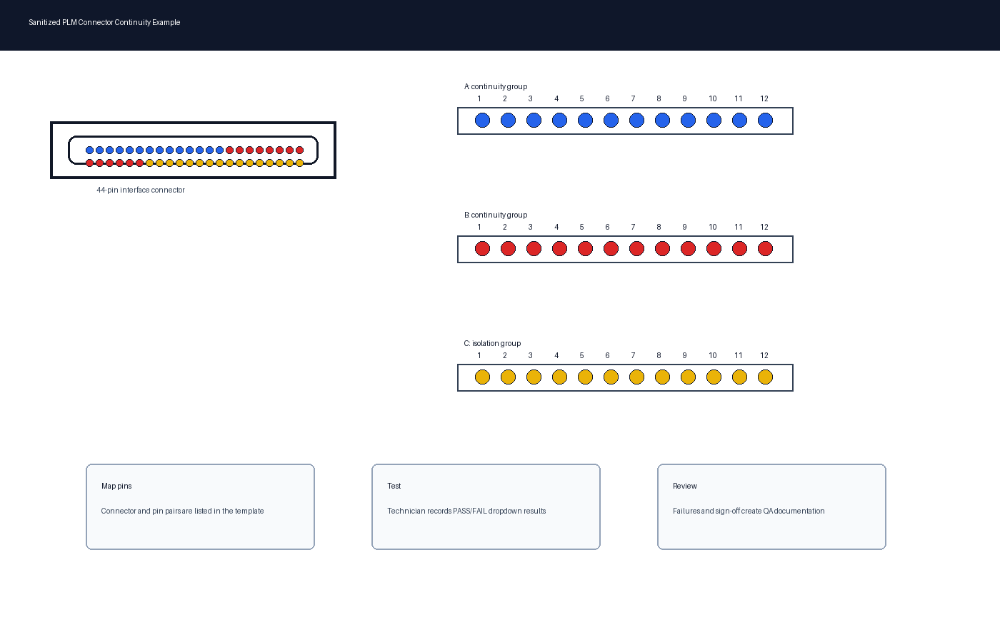

# PLM Continuity Test Tool

## Overview

This repository documents a sanitized Excel-based continuity and isolation verification tool for PLM connector assemblies. The workbook is designed to help technicians and quality teams record connector-to-pin test results, identify failures, and maintain consistent manufacturing test documentation.

The project demonstrates how a structured Excel template can support repeatable electrical verification while keeping the process simple, auditable, and easy to hand off across production and quality teams.

## Features

- Connector-to-pin continuity tracking
- PASS/FAIL dropdowns
- Isolation/short-check support
- Technician sign-off workflow
- Failure logging
- Quality documentation

## Tools Used

- Microsoft Excel
- Data Validation
- Conditional Formatting
- Electrical Test Procedures

## Skills Demonstrated

- Test Engineering
- Quality Assurance
- Electrical Testing
- Manufacturing Documentation
- Process Improvement

## Project Files

- `PLM_Continuity_Test_Template.xlsx` - sanitized Excel continuity test template
- `docs/project-summary.md` - project summary, workflow, and resume-ready language
- `images/plm_connector_example.png` - sanitized connector testing example image

## Example Image

## Privacy Note

This repository contains a sanitized demonstration template. Proprietary drawings, part numbers, internal procedures, and company-sensitive information have been removed or blurred.
